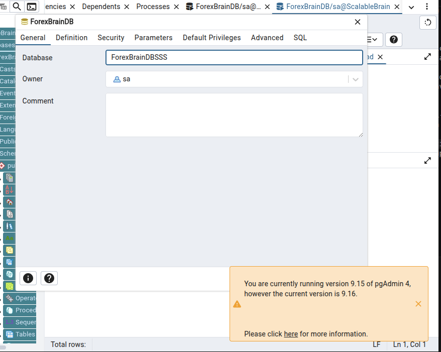

# FND-008 — Inter-Computer Networking & Security

- **Task ID**: FND-008
- **System**: Foundational & Cross-Cutting
- **Priority**: P1-High
- **Estimated Effort**: 2d
- **Prerequisites**: FND-003
- **External Dependencies**:
  - A mesh VPN. Recommended: **Tailscale** (WireGuard-based, NAT-traversing, free for personal use, MagicDNS) or self-hosted **WireGuard**. *Why:* the three computers (training PC, execution PC, always-on Computer 3) are likely on different networks/NATs and must reach each other's DB, queue, and object store privately.
  - **TLS certificates** for the DB, Redis, object store, and Layer 5 API endpoints (internal CA or Tailscale-provided certs). *Why:* encryption in transit for every cross-host hop.
  - Credentials and CA keys stored via FND-003.

## Objective
Securely network the three computers over a private mesh VPN with TLS on every service and least-privilege access, so no trading data or credential crosses the public internet in the clear.

## Current State
Everything runs on a single host, so there is no cross-host networking and no transport security between components — services bind to `localhost`. The `.env` even mislabels DB connection details. As soon as the system splits across three computers, the queue (FND-002), DB (FND-004), object store (FND-001), and Layer 5 API must traverse the network, currently with no secure transport defined.

## Target State
- All three hosts joined to one private mesh VPN with stable hostnames; no service exposed on the public internet.
- TLS on DB, Redis/queue, object store, and the Layer 5 API; certificate management documented.
- Firewall/ACL rules enforcing least privilege per host (e.g. Computer 1 reaches the DB and object store; Computer 2 reaches the queue, object store, broker; Computer 3 reaches DB, queue, notification providers).
- An access audit trail and a documented procedure to add/revoke a host.

## Technical Specification

### Network topology
- Join Computer 1/2/3 to a Tailscale tailnet (or WireGuard mesh). Use MagicDNS names (`comp1`, `comp2`, `comp3`) as the canonical service hostnames in all configs — never hardcode IPs.
- Outbound to external services (OANDA API, object store if cloud, Telegram/SMTP) goes over the normal internet with TLS; inbound to any host is **VPN-only**.

### Service exposure matrix (least privilege)
| Service | Host | Reachable by |
|---------|------|--------------|
| PostgreSQL/TimescaleDB | DB host | Computer 1 (rw), Computer 3 (rw), Computer 2 (limited/none) |
| Redis queues | broker host | Layer 3 (produce Scored), System 3 (rw), Layer 4 (Outbound consume / Inbound produce) |
| Object store (if self-hosted MinIO) | host | Computer 1 (rw), Computer 2 (ro), Computer 3 (rwp) |
| Layer 5 API | Computer 2 | operator browser over VPN |
| Notification egress | Computer 3 | outbound to Telegram/SMTP only |
- Enforce with host firewalls (ufw/nftables) bound to the VPN interface; default-deny inbound on public interfaces.

### Transport security
- TLS everywhere internal: Postgres `sslmode=verify-full`, Redis TLS, object store HTTPS, Layer 5 HTTPS. Use Tailscale certs or an internal CA whose root is distributed via FND-003.
- Mutual auth where practical (client certs for DB/queue) or strong passwords + IP allowlist on the VPN subnet.

### Access management & audit
- Per-host VPN keys; revoke a lost/compromised host from the tailnet admin (documented in FND-009).
- Log connection/auth events to FND-005; alert on auth failures and on any new device joining the tailnet.

## Testing & Validation
- From off-VPN, every internal service is **unreachable** (port scan shows closed/filtered); from on-VPN, the allowed matrix works and disallowed paths are denied.
- TLS verification: a client with the wrong/expired cert is rejected (no plaintext fallback).
- Hostname stability: reboot a host, confirm MagicDNS name still resolves and services reconnect without config edits.
- Revocation drill: revoke a test device and confirm it immediately loses access; auth-failure alert fires.
- Latency check: cross-host queue/DB round-trip stays within the System 3 < 100 ms decision budget (VPN overhead is negligible on H1).

## Rollback Plan
The VPN/TLS layer is additive transport. During single-host operation everything still binds locally; the mesh is introduced as hosts are split out. If the VPN misbehaves, a host can temporarily fall back to a direct allowlisted connection over a secured LAN, or the affected system pauses (EXEC-008 / AMS safe-pause) rather than communicate insecurely. No application logic changes to roll back.

## Acceptance Criteria
- [ ] All three hosts are on one private mesh VPN with stable hostnames; no internal service is reachable from the public internet.
- [ ] TLS is enforced on DB, queue, object store, and Layer 5 API, with cert verification (no plaintext fallback).
- [ ] Firewall/ACLs implement the least-privilege exposure matrix; disallowed host-to-service paths are denied.
- [ ] Device add/revoke procedure is documented and a revocation drill succeeds with an auth alert.
- [ ] Cross-host round-trips stay within the latency budget.

## Notes & Risks
- Tailscale is an external dependency/control-plane; the self-hosted WireGuard fallback removes that dependency at the cost of manual key management — note for FND-010 cost/availability review.
- If Computer 3 is a cheap VPS, ensure the provider's firewall + the host firewall both default-deny — VPS public IPs get scanned constantly.
- The VPN is on the execution path; its availability pairs with EXEC-008/AMS safe-pause so a network partition fails closed, never into unmanaged trading.
- Keep IP literals out of configs — use the VPN hostnames so host moves don't break the system.
