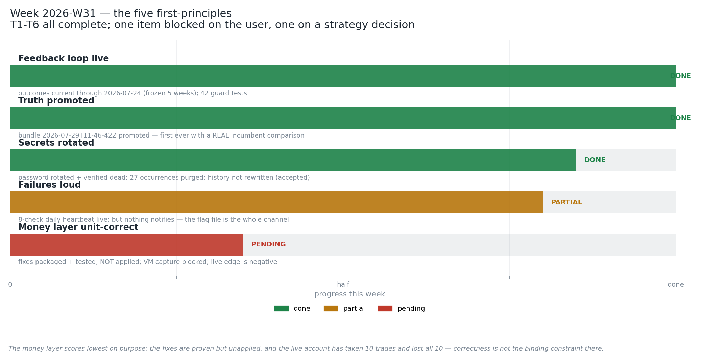

# Week 2026-W31 — Executive Summary

**Mon 27 July – Sun 2 August · System 1 · all six tasks complete**

---

## What happened, task by task

**T1 — the feedback loop was severed, and is now reconnected.**
`fact_trade_outcomes` had not been written since **23 June**. For five weeks every retrain
judged your strategies against frozen results while reporting success. The cause was not what
the plan assumed: three stacked breaks left by an old folder reorganisation, hidden because the
code caught the real error and reported an unrelated one instead. Outcomes are now current
through 24 July — 134,407 trades, 1,059 recovered from the dead period — and 42 new tests make
this class of break fail loudly.
→ [T1/DELIVERABLE.md](T1/DELIVERABLE.md) · [outcomes_timeline.png](T1/outcomes_timeline.png) · [import_graph.png](T1/import_graph.png)

**T2 — the database password is no longer in the repository.**
It sat in **11 tracked files, 27 times, since April** — including, awkwardly, the security
report describing the problem and the roadmap task titled "secrets management". Rotated, old
value verified dead, every occurrence purged, `.env.example` added.
→ [T2/DELIVERABLE.md](T2/DELIVERABLE.md) · [exposure_before_after.png](T2/exposure_before_after.png)

**T3 — the promotion safety gate had never once worked, and now does.**
The gate meant to stop a worse model going live had silently failed open on **all three
promotions this year**: it was looking for the live model on the wrong storage backend, finding
nothing, and treating that as permission. A second defect would have jammed it shut in the
opposite direction once it started working. Both fixed. You reviewed the evidence and chose to
promote; bundle `2026-07-29T11-46-42Z-55dacdbf` is live and is **the first promotion ever
subjected to a real comparison**.
→ [T3/DELIVERABLE.md](T3/DELIVERABLE.md) · [gates_dashboard.png](T3/gates_dashboard.png) · [map_diff_heatmap.png](T3/map_diff_heatmap.png)

**T4 — silent failures now have a watchdog.**
Eight daily checks over prices, trade outcomes, regimes, model-bundle integrity, telemetry,
retrain state, scheduler liveness and the code's own imports. First run: 8/8 green. Proven by
simulating July's dead price feed — CRITICAL, alert file raised, logged.
→ [T4/DELIVERABLE.md](T4/DELIVERABLE.md) · [freshness_dashboard.png](T4/freshness_dashboard.png) · [outage_history.png](T4/outage_history.png)

**T5 — two position-sizing bugs found, packaged, and not yet applied.**
Your "risk 2% per trade" rule was computed in the wrong currency: on yen pairs it risked 1/150th
of the intended amount, and on a cross pair it **breached the hard cap by 27%**. Your "maximum
25% exposure" limit counts positions rather than measuring exposure — a $1,100 book and a
$110,000 book both report the same number. Both fixes are proven by 23 tests and ready for your
Computer-3 session. **Neither has been applied.**
→ [T5/DELIVERABLE.md](T5/DELIVERABLE.md) · [sizing_error_magnitude.png](T5/sizing_error_magnitude.png) · [s3_risk_matrix.png](T5/s3_risk_matrix.png)

**T6 — new strategy ideas now have a sandbox with no side door.**
A contract, a registry, and a research → staged → qualified pipeline that judges candidates
using **the same gates the live system uses** — imported, not copied. Six attack attempts
(skipping gates, duplicate IDs, look-ahead peeking, writing to live tables) are each blocked by
code. The pilot strategy was **rejected** with five per-gate reasons after 9,806 out-of-sample
trades, which is the machine working correctly.
→ [T6/DELIVERABLE.md](T6/DELIVERABLE.md) · [pipeline_diagram.png](T6/pipeline_diagram.png) · [pilot_folds.png](T6/pilot_folds.png)

---

## The finding that matters most

Buried in the System-3 evidence, and larger than anything the week's plan anticipated:

> **The live account has taken 10 trades. All ten lost.**
> Profit factor 0.0 · −367 CAD per trade · lifetime **−15,935 CAD**.

The reason it stopped losing is an accident: a sizing gate jammed shut by an arithmetic
impossibility (it demands 20 recent trades from a window that can hold about 7). **That jam is
currently the only thing preventing further loss.**

This reframes the week. The engineering is in much better shape — the feedback loop works, the
promotion gate works, failures are visible, the sizing bugs are understood. But **none of that
addresses why every trade loses.** Fixing the sizing correctly and unblocking the gate, without
answering that question, would convert a stalled system into a reliably losing one.

It also lines up with what System 1 has been saying all along: the entire live model is one
strategy, and the regime classifier that is supposed to choose between strategies doesn't
actually distinguish them. Ten trades, ten losses is the empirical version of the same problem.

---

## Remaining risks

1. **Negative live edge** — the strategy loses money; nothing this week changed that.
2. **The code that sizes real positions exists only on the VM**, with no version control. If
   that machine is lost, it is lost. Unblocking takes you under five minutes.
3. **No rollback pointer.** The documentation promises `previous.json`; no code writes it. Rolling
   back the model means manually re-pointing (recoverable, not one-click).
4. **Your other two machines may still be on the old model** — the model-set pointer was not
   refreshed (deliberate staged-rollout guard).
5. **The heartbeat notifies nobody.** It writes a flag file; if no one looks, it is still quiet.
6. **The dead password remains in git history** (harmless — it no longer opens anything).

## Decisions waiting on you

| Decision | Recommendation |
|---|---|
| Publish the model set so Systems 2/3 receive the new bundle | Your call — it's a rollout step, not a consequence of the promotion |
| Run the VM capture command | **Do this first.** Five minutes, removes a single-point-of-loss |
| Apply the sizing fixes on Computer 3 | Yes — but do **not** unblock the jammed gate in the same session |
| Rewrite git history for the dead password | **No.** Breaks every clone to remove a risk that no longer exists |
| Turn on `GATEKEEPER_AUTOPROMOTE` | **Not yet.** Wait for the repaired gate to bind on ≥1 scheduled retrain |

## Recommended focus for 2026-W32

**Answer the strategy question.** Everything else is now instrumented well enough to support it.

1. **Why did all ten trades lose?** Compare live fills against what the backtest predicted for
   the same signals. That gap is the most valuable unknown in the system.
2. **Apply the money-layer fixes** (T5 handoff), leaving the lockout alone.
3. **Capture the VM code.**
4. **Teach the T6 sandbox regime-conditional evaluation** — it would let you finally test whether
   regimes discriminate, the assumption the whole strategy-selection design rests on.
5. Small and cheap: implement `previous.json`, add a bundle-level uplift regression check, and
   make the retrain refuse to run while a heartbeat alert is outstanding.
